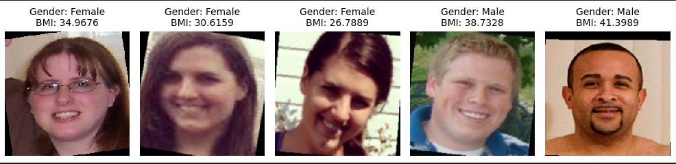

# Body Mass Index(BMI) prediction
Imagine a German car manufacturer, wants to develop a new feature for their driver monitoring solution. They have regular RGB cameras mounted in the center rear view mirror and want to assess the drivers BMI from pictures of the drivers Face. The task is to build a model to predict BMI based on single image input. Public Dataset from the US (trainset.csv, validationset.csv and the Imagefolder) are provided. This project is targeting German drivers and the software will run on a car ECU, which will decide the choice of network architecture.

The project requirements can be found in pyproject.toml and can be installed easily using poetry. As an alternative, _Requirements.txt_ is also provided. 

Run the notebook _bmi_prediction.ipynb_ after installing the project dependencies.

## Network
Pretrained [MobileNet V3 large](https://arxiv.org/abs/1905.02244) on ImageNet is used as backbone for BMI prediction. The network is capable of predicting gender of person as well along with bmi prediction. These gender features are concatentated to feature extractor of backbone network.

## Dataset and Training
Total of 2536 and 634 images are part of training and validation data. Augmentations are applied during training and can be visualized .

The bmi values are transformed using RobustScaler after looking at the bmi distribution. 

Combination of gender loss(cross-entropy) and bmi loss(smoothL1) is used for optimization using AdamW optimizer. BMI loss is weighted by a factor of 5. The network is trained for 40 epochs with decay LR after 25 epochs.

## Testing
This is described in the juypter notebook. Load the model _bmiprediction_mobilnetv3large_epoch40.model_ and replace the _validationset.csv_ with _testset.csv_. The model is exported to onnx format as well (_bmiprediction_mobilnetv3large_epoch40.onnx_). The test images should be present in dir _Images/CodingImages_, else change accordingly. As scaling is applied to targets, the targets and network predictions are transformed to original scale. Regression metrics MAE, MSE, RMSE, R2 score are computed for reference on validation set.

